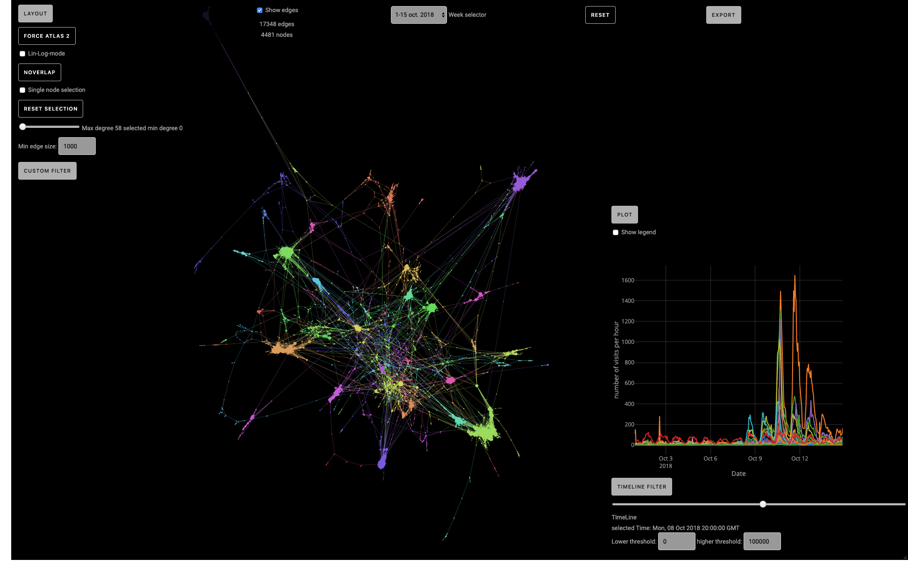

# Website
This website has been built as an interactive tool to display and render the time - varying activity of graphs.
The graph is based on a subset of Wikipedia Pages which have not only a connection, but also a time dependence.

The aim of the project is to give the user a tool to visualise the correlation between the activities of the pages as well as the overall structure of wikipedia.

Via the tool users can:
- Select several different graphs corresponding to different weeks.
- Change the layout of the graph.
- Display / hide nodes on the basis of their degree and number of clicks per hour.
- Display / hide edges on the basis of their length.
- Save SVG pictures or Gexf of the graph.
- Sava PNG pictures of the activitiies of the nodes over a period of time.

### Packages:

Plotly JS:
https://plot.ly/javascript/

Sigma JS:
http://sigmajs.org

Prettier styling:
https://prettier.io/

### Context
This project is a student project of the LTS2 lab at EPFL, Switzerland.
